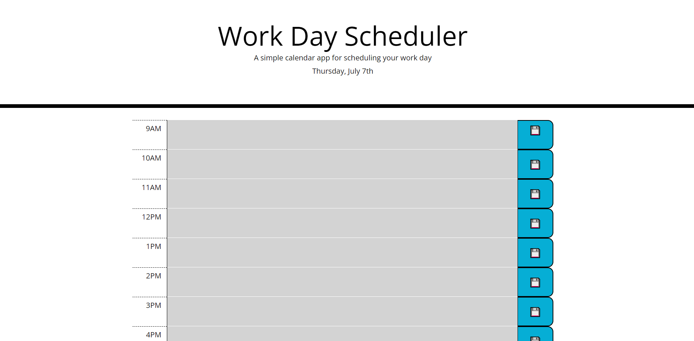

"# work-day-scheduler" 
# Description:
## Work day scheduler with color coded rows based on time of days. Information added into textareas will stay and pull from storage.
 

### Within this website, there will be 'Work Day Scheduler' as the header, fine text below the header with a simple description, and the current date below that.

### Below the header will be 9 rows from 9am to 5pm. Each row will have the time, a textbox, and a save button. Information can be typed into the textbox for scheduling purposes, then the save button can be clicked to store that information into local storage. This information will stay visible on page refresh
### Each row's color will change based on past, present, and future time. Past will be grayed out, present will be red, and future will be green.
 

# Screenshot Below:

 
 

# URL Links:
 
## Work Day Scheduler: https://morganegilbert.github.io/work-day-scheduler/
